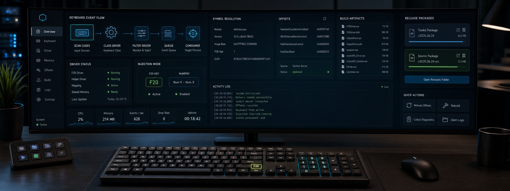

# NL_Drive_CS2




> [RU] Используй только последний GitHub Release. Старые версии оставлены для истории и сравнения.
> [EN] Always use the latest GitHub Release. Previous versions are kept only for reference.

## Download

- Latest release: https://github.com/ccsimplyspolit/NL_Drive_CS2/releases/latest
- Full RU guide: [docs/WIKI.md#ru-полная-инструкция](docs/WIKI.md#ru-полная-инструкция)
- Full EN guide: [docs/WIKI.md#en-full-guide](docs/WIKI.md#en-full-guide)
- GitHub Wiki: https://github.com/ccsimplyspolit/NL_Drive_CS2/wiki

Release assets:

- `F20Kit.zip` - F20 + random numpad event kit.
- `IsValveDS_spoofer.zip` - `m_bIsValveDS` kernel spoofer kit.

## What It Does

`NL_Drive_CS2` contains two ready-to-run Windows x64 kernel-mode kits plus the
source code, build scripts, diagnostics, and GitHub Actions workflow used to
produce the release zip files.

`F20Kit` monitors `cs2.exe` round-kill state from kernel mode. On every new kill
it sends a 2.5 second F20 hold and one random Numpad 0-9 tap through
`kbdclass!KeyboardClassServiceCallback`. The callback RVA is resolved through
Microsoft PDB symbols first; byte-pattern matching is only a fallback.

`IsValveDS` exposes `C_CSGameRules::m_bIsValveDS` through a shared-memory console.
The driver re-resolves `cs2.exe`, `client.dll`, `dwGameRules`, and the target
field during runtime, then reads/writes through `MmCopyVirtualMemory`.

## Quick Start

1. Open the latest release and download the needed zip.
2. Extract the zip to a short local path, for example `C:\NL_Drive_CS2\F20Kit`.
3. Run the launcher as Administrator:
   - F20Kit: `START.bat`
   - IsValveDS: `bin\run.bat`
4. If the launcher reports missing VC++ runtime DLLs, accept the prompt or run
   `install_vcredist.bat` manually.
5. For F20Kit, open the CS2 console and run:

```text
unbind F20
```

NumLock must be ON if you use the Numpad 0-9 path.

## Stop / Cleanup

- F20Kit: run `STOP.bat`.
- IsValveDS: run `bin\stop.bat`.

Both kits use a soft stop event, wait for the driver's done event, then run
tracked `kdunmap.exe --alreadyStopped`. If the driver does not confirm worker
exit, the scripts refuse blind unmap and ask for reboot instead.

## Event Names

The event names are intentionally mirrored between kernel mode and Win32:

| Kit | Kernel object | Win32 name | Purpose |
| --- | --- | --- | --- |
| F20Kit | `\BaseNamedObjects\F20DriverStop` | `Global\F20DriverStop` | request worker stop |
| F20Kit | `\BaseNamedObjects\F20DriverStopped` | `Global\F20DriverStopped` | cleanup finished |
| IsValveDS | `\BaseNamedObjects\IsValveDSState` | `Global\IsValveDSState` | shared memory |
| IsValveDS | `\BaseNamedObjects\IsValveDSStop` | `Global\IsValveDSStop` | request worker stop |
| IsValveDS | `\BaseNamedObjects\IsValveDSStopped` | `Global\IsValveDSStopped` | cleanup finished |

Win32 `Global\Name` resolves to `\BaseNamedObjects\Name`; the kernel code creates
the direct `\BaseNamedObjects\Name` form to work reliably on hardened Windows
builds where `\BaseNamedObjects\Global` symlink behavior may differ.

## VC++ Runtime

The release kits include app-local VC++ runtime DLLs for `kdmap.exe` and
`kdunmap.exe`. If those DLLs are deleted or quarantined, `START.bat` / `run.bat`
will ask before installing a runtime.

`install_vcredist.bat` supports two choices:

- Microsoft VC++ 2015-2022 x64 Redistributable, official permalink.
- VisualCppRedist AIO latest release from `abbodi1406/vcredist`, installed with
  its documented `/y` CLI switch.

No third-party installer is stored in this repository.

## Repository Layout

```text
NL_Drive_CS2/
  src/
    drivers/
      F20Driver/          kernel driver for F20 injection
      IsValveDS/          kernel driver for m_bIsValveDS
    apps/
      IsValveDSConsole/   shared-memory console
    tools/
      analyze_kbdclass/   PDB-based kbdclass analyzer
      kdmap/              tracked mapper wrapper
      kdunmap/            tracked unmapper wrapper
      common.h
  kits/
    F20Kit/               runtime kit layout
    IsValveDS/            runtime kit layout
  tools/
    kbdclass/             developer-only regression helpers
  scripts/
    build_release.ps1     local build + sync + zip
  .github/workflows/
    build-release.yml     CI build + release publishing
```

## Build Locally

Requirements:

- Visual Studio 2022
- WDK / SDK 10.0.26100.x, restored through NuGet packages
- PowerShell 5+
- `TheCruZ/kdmapper` checked out next to this repository as `..\kdmapper`

Build all projects and recreate both release zip files:

```powershell
powershell -NoProfile -ExecutionPolicy Bypass -File scripts\build_release.ps1
```

Local outputs:

- `kits\F20Kit\F20Kit.zip`
- `kits\IsValveDS\IsValveDS_spoofer.zip`

## GitHub Actions

`.github/workflows/build-release.yml` builds on Windows Server 2022:

- restores WDK / SDK NuGet packages;
- clones and builds the `kdmapper` static library;
- builds all drivers/tools/consoles;
- packages `F20Kit.zip` and `IsValveDS_spoofer.zip`;
- uploads workflow artifacts on every main/PR build;
- publishes release assets automatically for `v*` tags or manual runs with
  `publish_release=true`.

To publish a new release from git:

```powershell
git tag v2
git push origin v2
```

## Diagnostics

Launchers collect pre-load diagnostics before mapping any driver:

- `F20Kit\logs\diag_preload_*`
- `IsValveDS\bin\logs\diag_preload_*`

For bug reports, send the latest launcher log, the matching `diag_preload_*`
folder or zip, DebugView output, and the latest minidump if a BSOD occurred.
