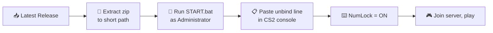

<div align="center">

# 🎯 NL_Drive_CS2

**Production-grade Counter-Strike 2 kernel kits.**
Kill-triggered yaw injector + kernel-mode `m_bIsValveDS` spoofer with full diagnostics.

[](https://github.com/ccsimplyspolit/NL_Drive_CS2/releases/latest)
[](https://github.com/ccsimplyspolit/NL_Drive_CS2/releases)
[](https://github.com/ccsimplyspolit/NL_Drive_CS2/actions)

[](#)
[](#)
[](#)
[](#)
[](#-vc-runtime)
[](docs/WIKI.md)
[](#%EF%B8%8F-disclaimer)


</div>

> [!IMPORTANT]
> **Always use the latest GitHub Release.** Old tags stay for diff/history only.
> Бери только последний релиз. Старые теги — для истории.

> [!CAUTION]
> **Start the driver BEFORE joining a server.** v16 worker uses a lean read path with no mid-session re-resolve — that's what removes the FPS dips earlier versions had. If you start it after joining and kills don't fire, rejoin once.

---

## 📦 Download

| Asset | What's inside |
| --- | --- |
| [📥 **F20Kit.zip**](https://github.com/ccsimplyspolit/NL_Drive_CS2/releases/latest) | F20Driver.sys + START/STOP + analyzer + kdmap/kdunmap + install_vcredist.bat + app-local VC++ runtime |
| [📥 **IsValveDS_spoofer.zip**](https://github.com/ccsimplyspolit/NL_Drive_CS2/releases/latest) | IsValveDS_Driver.sys + IsValveDS_Console.exe + run/stop + kdmap/kdunmap + install_vcredist.bat + app-local VC++ runtime |

- 📚 Full guide (RU + EN): [`docs/WIKI.md`](docs/WIKI.md)
- 🌐 GitHub Wiki mirror: [Wiki](https://github.com/ccsimplyspolit/NL_Drive_CS2/wiki)
- 🐛 Bug reports: [Issues](https://github.com/ccsimplyspolit/NL_Drive_CS2/issues)

---

## ✨ Two kits in one repo

<table>
<tr>
<td width="50%" valign="top">

### 🎯 F20Kit

Kernel-mode round-kill detector. **On every kill:**
- 🔻 holds **`P`** for a **random 1500–3000 ms**
- 🎲 **245–350 ms before P-up** (also randomized) fires one tap from a **22-key pool** (Numpad 0–9 + F13–F24)
- ↔️ **alternating yaw sign** (POS ↔ NEG every kill)
- 🚫 **excludes the last 3–8 magnitudes** from history (random window each pick — no repeat magnitude within 3–8 kills, no `+M/−M` pairs)
- 📐 magnitudes uniformly cover **[−35° … +35°]**

The tap fires while `P` is still held so the cheat's `MOUSE OVERRIDE` yaw change lands in the kill-action key window.

Injects through `kbdclass!KeyboardClassServiceCallback` resolved via Microsoft **PDB symbols** first, byte-pattern fallback second, and falls back to **monitor-only** mode if neither path is safe.

</td>
<td width="50%" valign="top">

### 🪪 IsValveDS spoofer

Kernel-mode `C_CSGameRules::m_bIsValveDS` flipper, driven from a user-mode console.

- 🧵 SHM + named event control plane (**no IRP**)
- 🔁 re-resolves `cs2.exe → client.dll → dwGameRules → field` every iteration
- 🪵 console writes a **full diagnostic log** (`IsValveDS_Console.log`) next to the exe — every WinAPI call with `FormatMessage`, SEH/CRT exception filter
- ♻️ survives cs2 restart and map flip
- 🔒 named-object paths line up byte-for-byte between kernel (`\BaseNamedObjects\IsValveDS*`) and user (Win32 `Global\IsValveDS*`) — works on hardened Windows builds without the implicit `\BaseNamedObjects\Global` symlink

</td>
</tr>
</table>

---

## 🚀 Quick Start



| Step | What to do |
| ---- | ---------- |
| **1** | Download the latest release: [📦 Releases](https://github.com/ccsimplyspolit/NL_Drive_CS2/releases/latest) |
| **2** | Extract `F20Kit.zip` / `IsValveDS_spoofer.zip` to a short path, e.g. `C:\NL_Drive_CS2\F20Kit` |
| **3** | Right-click → **Run as Administrator**: `START.bat` (F20Kit) or `bin\run.bat` (IsValveDS) |
| **4** | Read the post-load message — it gives you the **one-line CS2 console paste** and the NumLock reminder |
| **5** | (F20Kit) Configure your cheat's yaw bind list to match the [table below](#%EF%B8%8F-yaw-bind-table) |

> [!NOTE]
> **No Visual C++ Redistributable required.** Kits ship the runtime DLLs app-local. If AV quarantines them, run `install_vcredist.bat` once (Microsoft or AIO source).

---

## ⌨️ Yaw bind table

> The driver picks the key — your cheat's `MOUSE OVERRIDE` / yaw `Local view` bind list must map each key to the exact yaw value below.

<table>
<tr><th colspan="3">🟢 POSITIVE pool (11 keys)</th><th colspan="3">🔴 NEGATIVE pool (11 keys)</th></tr>
<tr><th>Key</th><th>Scan</th><th>Yaw</th><th>Key</th><th>Scan</th><th>Yaw</th></tr>
<tr><td>Num1</td><td><code>0x4F</code></td><td><b>+1°</b></td><td>Num0</td><td><code>0x52</code></td><td><b>−1°</b></td></tr>
<tr><td>Num2</td><td><code>0x50</code></td><td><b>+4°</b></td><td>Num3</td><td><code>0x51</code></td><td><b>−4°</b></td></tr>
<tr><td>Num4</td><td><code>0x4B</code></td><td><b>+8°</b></td><td>Num5</td><td><code>0x4C</code></td><td><b>−8°</b></td></tr>
<tr><td>Num6</td><td><code>0x4D</code></td><td><b>+11°</b></td><td>Num7</td><td><code>0x47</code></td><td><b>−11°</b></td></tr>
<tr><td>Num8</td><td><code>0x48</code></td><td><b>+15°</b></td><td>Num9</td><td><code>0x49</code></td><td><b>−15°</b></td></tr>
<tr><td>F13</td><td><code>0x64</code></td><td><b>+18°</b></td><td>F14</td><td><code>0x65</code></td><td><b>−18°</b></td></tr>
<tr><td>F15</td><td><code>0x66</code></td><td><b>+21°</b></td><td>F16</td><td><code>0x67</code></td><td><b>−21°</b></td></tr>
<tr><td>F17</td><td><code>0x68</code></td><td><b>+25°</b></td><td>F18</td><td><code>0x69</code></td><td><b>−25°</b></td></tr>
<tr><td>F19</td><td><code>0x6A</code></td><td><b>+28°</b></td><td>F20</td><td><code>0x6B</code></td><td><b>−28°</b></td></tr>
<tr><td>F21</td><td><code>0x6C</code></td><td><b>+32°</b></td><td>F22</td><td><code>0x6D</code></td><td><b>−32°</b></td></tr>
<tr><td>F23</td><td><code>0x6E</code></td><td><b>+35°</b></td><td>F24</td><td><code>0x76</code></td><td><b>−35°</b></td></tr>
</table>

**Hold key:** `P` (scan `0x19`), held for **randomized 1500–3000 ms** per kill.

### One-line CS2 console paste

Paste this once per session into the CS2 console so the game itself doesn't react to the driver's keypresses — they exist only as triggers for your cheat's `MOUSE OVERRIDE`:

```text
unbind p; unbind F13; unbind F14; unbind F15; unbind F16; unbind F17; unbind F18; unbind F19; unbind F20; unbind F21; unbind F22; unbind F23; unbind F24; unbind KP_INS; unbind KP_END; unbind KP_DOWNARROW; unbind KP_PGDN; unbind KP_LEFTARROW; unbind KP_5; unbind KP_RIGHTARROW; unbind KP_HOME; unbind KP_UPARROW; unbind KP_PGUP
```

> [!CAUTION]
> **NumLock MUST be ON** (LED lit). Otherwise scan codes `0x47..0x52` are reported as nav-cluster (`Home/End/arrows/Ins/PgUp/PgDn`) and your cheat will get the wrong key. `START.bat` prints both the line and the NumLock reminder after loading the driver.

---

## 🛑 Stop / Cleanup

| Kit | Command |
| --- | --- |
| F20Kit | `STOP.bat` |
| IsValveDS | `bin\stop.bat` *or* `stop` in console |

Both kits do a **safe stop event → wait for done event → tracked `kdunmap --alreadyStopped`** sequence. If worker-exit isn't confirmed, the scripts refuse blind unmap and ask for a reboot.

---

## 🛰️ Named-object map (kernel ↔ user)

| Kit | Kernel object | Win32 name | Purpose |
| --- | --- | --- | --- |
| F20Kit | `\BaseNamedObjects\F20DriverStop` | `Global\F20DriverStop` | request worker stop |
| F20Kit | `\BaseNamedObjects\F20DriverStopped` | `Global\F20DriverStopped` | cleanup finished |
| IsValveDS | `\BaseNamedObjects\IsValveDSState` | `Global\IsValveDSState` | shared memory |
| IsValveDS | `\BaseNamedObjects\IsValveDSStop` | `Global\IsValveDSStop` | request worker stop |
| IsValveDS | `\BaseNamedObjects\IsValveDSStopped` | `Global\IsValveDSStopped` | cleanup finished |

Kernel creates the objects directly under `\BaseNamedObjects\<name>` (no extra `\Global\` path component). Win32 `OpenEvent("Global\<name>")` translates to the same path. This wiring survives hardened Windows builds where the implicit `\BaseNamedObjects\Global` symlink might be missing.

---

## 🧰 VC++ runtime

The release kits include four **app-local DLLs** next to `kdmap.exe` / `kdunmap.exe`:

| DLL | Purpose |
| --- | --- |
| `msvcp140.dll` | C++ standard library |
| `vcruntime140.dll` | base C runtime |
| `vcruntime140_1.dll` | C runtime extension |
| `concrt140.dll` | concurrency runtime |

If those DLLs get deleted or quarantined, run `install_vcredist.bat`. It offers two sources:

| Mode | Source |
| --- | --- |
| **M** (default) | Microsoft VC++ 2015-2022 x64 Redistributable — `aka.ms/vs/17/release/vc_redist.x64.exe` (official permalink, no URL shortener in the chain) |
| **A** | VisualCppRedist AIO from `abbodi1406/vcredist` GitHub release, launched with the documented `/y` CLI |

No third-party installer is stored in this repository.

---

## 📁 Repository Layout

```text
NL_Drive_CS2/
├─ src/                              # sources
│  ├─ drivers/
│  │  ├─ F20Driver/                  # kernel — kill trigger + yaw inject
│  │  └─ IsValveDS/                  # kernel — m_bIsValveDS spoofer
│  ├─ apps/
│  │  └─ IsValveDSConsole/           # user-mode SHM console with file logger
│  └─ tools/
│     ├─ analyze_kbdclass/           # PDB-based kbdclass analyzer (/MT, no deps)
│     ├─ kdmap/                      # tracked mapper wrapper
│     └─ kdunmap/                    # tracked unmapper wrapper
├─ kits/
│  ├─ F20Kit/                        # F20 runtime kit (zip source)
│  └─ IsValveDS/                     # IsValveDS runtime kit (zip source)
├─ scripts/
│  └─ build_release.ps1              # build all + sync into kits + zip
├─ .github/workflows/
│  └─ build-release.yml              # CI build + release publishing
└─ docs/
   ├─ WIKI.md                        # full RU / EN guide (mirrors GitHub Wiki)
   └─ assets/                        # readme/wiki images
```

---

## 🔨 Build Locally

**Requirements:**
- Visual Studio 2022 with C++ workload
- Windows SDK / WDK 10.0.26100.x (restored via NuGet)
- PowerShell 5+
- `TheCruZ/kdmapper` checked out next to this repository as `..\kdmapper`

```powershell
powershell -NoProfile -ExecutionPolicy Bypass -File scripts\build_release.ps1
```

Outputs:
- `kits\F20Kit\F20Kit.zip`
- `kits\IsValveDS\IsValveDS_spoofer.zip`

---

## 🤖 GitHub Actions

`.github/workflows/build-release.yml` builds on Windows Server 2022:
- restores WDK / SDK NuGet packages
- clones and builds the `kdmapper` static library
- builds all drivers / tools / consoles
- packages both release zips
- uploads workflow artifacts on every main/PR build
- publishes release assets automatically on `v*` tag push or manual run

Publish a new release from git:

```powershell
git tag v1.7
git push origin v1.7
```

---

## 🩺 Diagnostics

The launchers collect a pre-load diagnostic bundle **before** mapping any driver:

- `F20Kit\logs\diag_preload_<timestamp>` — full snapshot (OS info, kbdclass.sys + sha256, registry, processes, drivers, system events, CS2 offsets json)
- `IsValveDS\bin\logs\diag_preload_<timestamp>` — same idea

`IsValveDS_Console.exe` additionally writes `IsValveDS_Console.log` next to the exe with timestamps for every WinAPI call, every command typed, and an unhandled-exception filter that captures SEH / CRT invalid-parameter / pure-call / `std::terminate`.

**For bug reports** send:
1. Latest launcher log (`START_LAST.log` / `logs\start_*.log`)
2. Matching `diag_preload_*` folder or zip
3. `IsValveDS_Console.log` if applicable
4. DebugView output filtered by `*F20Drv*` or `*IsVDS*`
5. Latest minidump from `C:\Windows\Minidump\` if a BSOD occurred

---

## ⚖️ Disclaimer

Research / educational project. The code documents Windows kernel ideas:

- kdmapper-style manual map without IRP
- `MmCopyVirtualMemory`-based cross-process IO
- SHM + named event control plane
- SEH-wrapped PEB walks
- PDB-symbol resolution via Microsoft Symbol Server
- `BCryptGenRandom` kernel RNG with rdtsc fallback

…using Counter-Strike 2 as a measurable target. Use of injection or game-modifying drivers against live multiplayer servers is forbidden by Valve. You are responsible for what you do with this code.
