<div align="center">

# 📘 NL_Drive_CS2 — Wiki

**Production-grade Counter-Strike 2 kernel kits — kill-trigger yaw injector + `m_bIsValveDS` spoofer.**

[](https://github.com/ccsimplyspolit/NL_Drive_CS2/releases/latest)
[](https://github.com/ccsimplyspolit/NL_Drive_CS2/releases)
[](https://github.com/ccsimplyspolit/NL_Drive_CS2/actions)

[](https://www.microsoft.com/en-us/windows)
[](#)
[](#)
[](#)
[](#-disclaimer)


---

<table>
<tr>
<td align="center" width="50%">

### 🇷🇺 Русский
[**Полная инструкция ↓**](#-ru-полная-инструкция)

</td>
<td align="center" width="50%">

### 🇬🇧 English
[**Full guide ↓**](#-en-full-guide)

</td>
</tr>
</table>

</div>

---

# 🇷🇺 RU Полная инструкция

## 📑 Содержание

- [🌟 Обзор](#-обзор)
- [⚙️ Как работает F20Driver — детально](#%EF%B8%8F-как-работает-f20driver--детально)
- [🪪 Как работает IsValveDS — детально](#-как-работает-isvalveds--детально)
- [💻 Требования к системе](#-требования-к-системе)
- [📦 Установка](#-установка)
- [🚀 Запуск F20Kit](#-запуск-f20kit)
- [⌨️ Yaw-биндов таблица](#%EF%B8%8F-yaw-биндов-таблица)
- [📋 Одна строка для CS2 console](#-одна-строка-для-cs2-console)
- [🪪 Запуск IsValveDS](#-запуск-isvalveds)
- [🛑 Остановка](#-остановка)
- [🩺 Диагностика](#-диагностика)
- [❌ Частые ошибки](#-частые-ошибки)
- [🧰 VC++ runtime](#-vc-runtime)
- [🔨 Сборка из исходников](#-сборка-из-исходников)
- [🤖 GitHub Actions](#-github-actions)
- [📁 Структура репозитория](#-структура-репозитория)
- [⚖️ Disclaimer](#%EF%B8%8F-disclaimer)

---

## 🌟 Обзор

**`NL_Drive_CS2`** — это два **kernel-mode kit'а** для Counter-Strike 2:

<table>
<tr>
<th width="50%">🎯 F20Kit</th>
<th width="50%">🪪 IsValveDS spoofer</th>
</tr>
<tr>
<td valign="top">

Kernel-mode round-kill detector + yaw inject.

**Поведение на каждый kill:**
- 🔻 нажимает `P` ↓
- ⏱ держит **рандомные 1500-3000 ms**
- 🎲 за **245-350 ms до отпускания** жмёт одну из 22 клавиш (Numpad 0-9 + F13-F24) с привязкой к yaw `[-35°..+35°]` в чите
- 🔺 отпускает `P` ↑

**OPSEC:**
- знак yaw чередуется (POS ↔ NEG) на каждый kill
- magnitude из **10 кандидатов** (исключая последние **3-8** из истории)
- никаких `+M / -M` подряд, никаких повторов в окне 3-8 kills
- timing полностью рандомизирован — нет периодического pattern'а

</td>
<td valign="top">

Kernel-mode spoof `CCSGameRules::m_bIsValveDS`.

**Архитектура:**
- shared-memory + named-event control plane (НЕ IRP)
- user-mode SHM-консоль управляет драйвером
- driver re-resolves `cs2.exe → client.dll → dwGameRules → field` каждую итерацию
- переживает рестарт `cs2.exe` и смену карты

**Диагностика:**
- console пишет полный `IsValveDS_Console.log` с timestamps, FormatMessage для каждого WinAPI failure, SEH/CRT exception filter

</td>
</tr>
</table>

---

## ⚙️ Как работает F20Driver — детально

### Цепочка чтения CS2 памяти

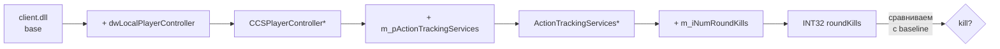

Каждый poll-tick (раз в **100 ms**) драйвер:
1. Делает один **`MmCopyVirtualMemory`** chain (3 кросс-процессных read'а)
2. Сравнивает с baseline
3. Если `roundKills > lastRoundKills` и не в cooldown → **TRIGGER**

### Timeline одного kill-цикла


Конкретные значения jitter'ятся **на каждый kill**:

| Параметр | Min | Max | Назначение |
|---|---|---|---|
| `KILL_HOLD_MS` | **1500 ms** | **3000 ms** | сколько держится `P` |
| `TAP_LEAD_MS` | **245 ms** | **350 ms** | за сколько до `P-up` срабатывает tap |
| `NUMPAD_TAP_MS` | **55 ms** | **55 ms** | как долго удерживается tap-key |
| `POLL_INTERVAL_MS` | **100 ms** | — | как часто driver читает chain |

**Пример:** `hold=2347`, `lead=287` → `P_down` at `T=0`, `tap_down` at `T=2060`, `tap_up` at `T=2115`, `P_up` at `T=2347`.

### Picker — выбор tap-клавиши

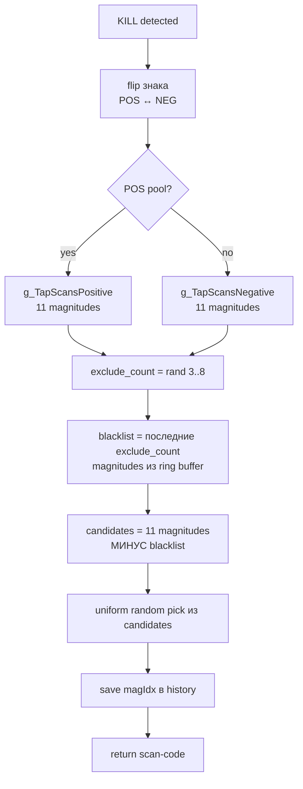

**Ключевое:**
- Знак yaw **гарантированно** меняется на каждый kill
- Magnitude (величина) **не повторяется** в окне 3..8 kills (random окно)
- Pool никогда не пуст: 11 magnitudes − up to 8 blacklist = **минимум 3 кандидата**

### Inject path

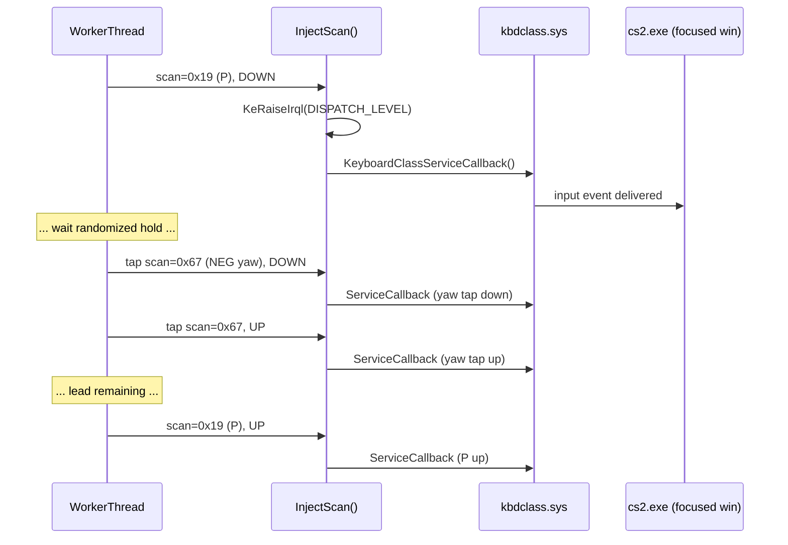

`kbdclass!KeyboardClassServiceCallback` находится через **Microsoft PDB symbols** (analyze_kbdclass.exe), либо через byte-pattern fallback. Если ни то ни другое не safe → **monitor-only mode**, без inject, без BSOD-риска.

### Safety net — Inject self-recovery

Если `g_KbdCallback` бросает SEH exception (kbdclass занят, бажный target):

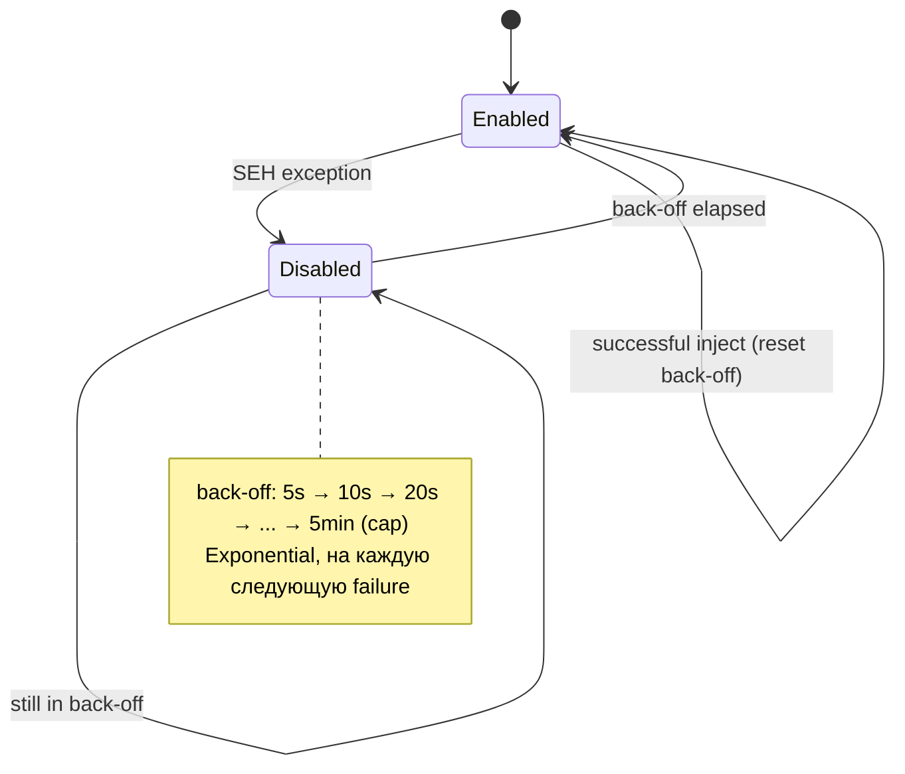

Раньше **одна** SEH exception навсегда отключала inject. Теперь — экспоненциальный back-off с авто-рекавери.

---

## 🪪 Как работает IsValveDS — детально

### Архитектура

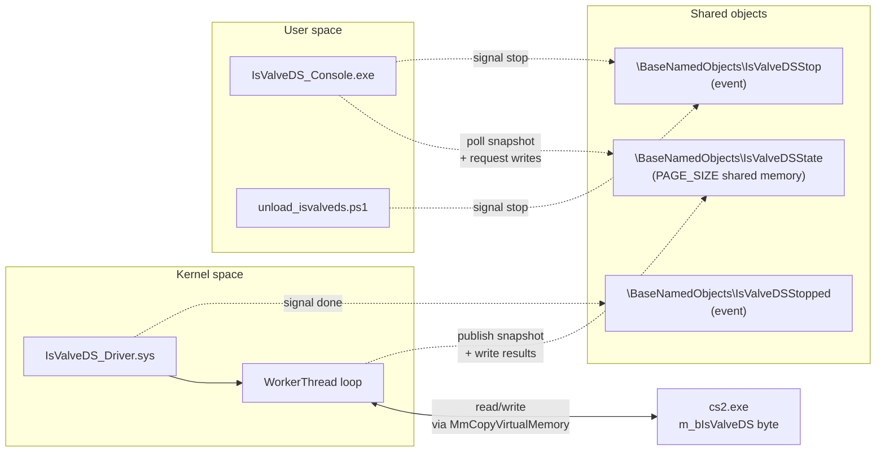

### Worker thread

Каждую итерацию (POLL_INTERVAL_MS = 200 ms):
1. Re-resolve `cs2.exe` (через `ZwQuerySystemInformation(5)`)
2. Re-resolve `client.dll` базу (PEB walk `InLoadOrderModuleList`)
3. Прочитать `dwGameRules` slot → ptr к C_CSGameRules
4. Прочитать `m_bIsValveDS` byte
5. Опубликовать snapshot в SHM (magic + barrier)
6. Если есть pending write request — re-verify, write, readback

**Все** обращения к user memory обернуты в `__try/__except`. Все указатели проверяются через `IsAddrValid()`. `PsGetProcessExitStatus()` gating на каждой итерации.

### SHM protocol

```cpp
struct ISVALVEDS_STATE {
    uint32 magic;                  // = ISVALVEDS_MAGIC когда current_* валидны
    int32  current_value;          // 0/1/-1
    uint32 current_error;          // VDS_ERR_*
    uint64 current_address;        // абс. адрес m_bIsValveDS
    uint64 last_poll_systime;
    uint32 driver_tick;
    uint32 cs2_pid;
    uint64 client_base;

    uint32 desired_value;          // user pишет
    uint32 write_request_id;       // user инкрементирует = запрос на запись

    uint32 write_handled_id;       // driver выставляет == request_id когда сделано
    uint32 write_error;            // VDS_ERR_* для последней записи
    int32  write_result_value;     // readback после записи
    uint64 write_handled_systime;
};
```

Driver всегда сбрасывает `magic = 0` ПЕРЕД обновлением полей, потом ставит memory barrier, потом `magic = ISVALVEDS_MAGIC`. Console читает с retry если magic torn.

---

## 💻 Требования к системе

<table>
<tr>
<th>Компонент</th>
<th>Требование</th>
<th>Автофикс?</th>
</tr>
<tr><td>OS</td><td>Windows 10 (1607+) или 11 x64</td><td>—</td></tr>
<tr><td>Права</td><td>Administrator</td><td>✅ launcher сам elevate</td></tr>
<tr><td>Secure Boot</td><td>OFF</td><td>❌ только из BIOS/UEFI</td></tr>
<tr><td>HVCI / Memory Integrity</td><td>OFF</td><td>✅ START.bat</td></tr>
<tr><td>VulnerableDriverBlocklist</td><td>= 0</td><td>✅ START.bat (reboot)</td></tr>
<tr><td>VC++ Redistributable</td><td>не нужен</td><td>✅ app-local DLLs в kit</td></tr>
<tr><td>Python</td><td>не нужен</td><td>—</td></tr>
<tr><td>cs2.exe</td><td>запущен</td><td>—</td></tr>
<tr><td>NumLock</td><td>ON (для Numpad scancodes)</td><td>❌ вручную</td></tr>
<tr><td>AntiCheat (vgc / EAC / BE / FACEIT)</td><td>не запущен</td><td>✅ START.bat (kill)</td></tr>
<tr><td>iqvw64e lingering</td><td>не загружен</td><td>✅ START.bat (clean)</td></tr>
</table>

> [!IMPORTANT]
> **Запускай драйвер ДО захода на сервер.** Worker v16 не делает mid-session re-resolve (это убирает FPS dips). Если стартуешь после захода и kills не пошли — просто перезайди на сервер.

---

## 📦 Установка

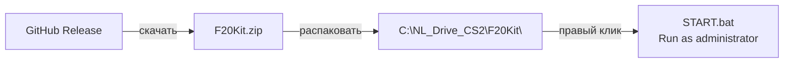

1. Открой [📦 Releases](https://github.com/ccsimplyspolit/NL_Drive_CS2/releases/latest)
2. Скачай нужный архив:

| Архив | Содержимое |
| --- | --- |
| **`F20Kit.zip`** | `F20Driver.sys` + `START.bat`/`STOP.bat` + `analyze_kbdclass.exe` + `kdmap.exe`/`kdunmap.exe` + PS1 скрипты + app-local VC++ runtime + `install_vcredist.bat` |
| **`IsValveDS_spoofer.zip`** | `IsValveDS_Driver.sys` + `IsValveDS_Console.exe` + `run.bat`/`stop.bat` + `kdmap.exe`/`kdunmap.exe` + PS1 скрипты + app-local VC++ runtime + `install_vcredist.bat` |

3. Распакуй в **короткий путь без кириллицы**:

```text
C:\NL_Drive_CS2\F20Kit
C:\NL_Drive_CS2\IsValveDS
```

> [!WARNING]
> Используй **ТОЛЬКО latest release**. Старые теги (`v1.0..v1.5`) оставлены для diff/history и могут содержать regressed-логику.

---

## 🚀 Запуск F20Kit

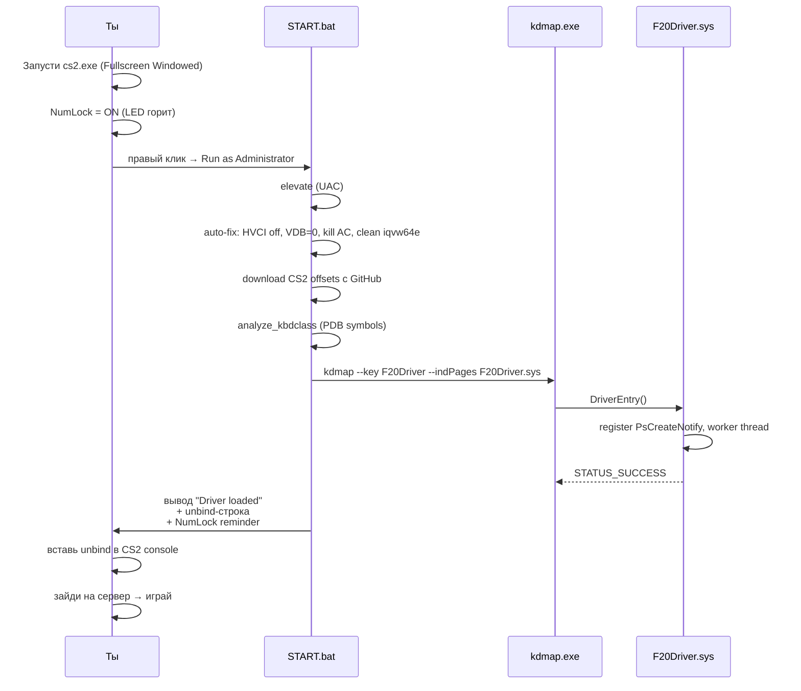

**START.bat делает:**

| Шаг | Описание |
|---|---|
| 1 | Создаёт `logs\start_<timestamp>.log` + alias `START_LAST.log` |
| 2 | Полная pre-load диагностика в `logs\diag_preload_*` (system info, drivers, kbdclass.sys, registry, processes, events) |
| 3 | Safe-stop предыдущего instance + tracked `kdunmap` |
| 4 | `update_cs2_offsets.ps1` — скачивает свежие offsets из `a2x/cs2-dumper` (TLS 1.2/1.3, sanity-check) |
| 5 | `analyze_kbdclass.exe` — резолвит `KeyboardClassServiceCallback` через PDB symbols |
| 6 | `kdmap.exe --key F20Driver --stopEvent "Global\F20DriverStop" --indPages F20Driver.sys` |
| 7 | Выводит **готовую unbind-строку** + **NumLock reminder** + **STEP 0 "Launch before server"** |

После загрузки увидишь в кончике вывода:

```
====================================================
 Driver loaded. F20Driver v16 - lean worker (100 ms poll)
====================================================

 STEP 0. !!! IMPORTANT !!!
         START THIS DRIVER *BEFORE* JOINING A SERVER.
         ...

 STEP 1. NumLock must be ON ...

 STEP 2. Open CS2 console (~) and paste this ONE line:

 unbind p; unbind F13; ... (см. ниже одной строкой)

 STEP 3. Configure your cheat's yaw "Local view" / MOUSE
         OVERRIDE binds to match the table from README.txt
```

---

## ⌨️ Yaw-биндов таблица

> **Драйвер выбирает кнопку** — твой **чит должен** привязать эту кнопку к точно соответствующему yaw в MOUSE OVERRIDE / "Local view" yaw списке.

<table>
<tr>
<th colspan="3">🟢 POSITIVE pool (11 keys)</th>
<th colspan="3">🔴 NEGATIVE pool (11 keys)</th>
</tr>
<tr><th>Key</th><th>Scan</th><th>Yaw</th><th>Key</th><th>Scan</th><th>Yaw</th></tr>
<tr><td>Num1</td><td><code>0x4F</code></td><td><b>+1°</b></td><td>Num0</td><td><code>0x52</code></td><td><b>−1°</b></td></tr>
<tr><td>Num2</td><td><code>0x50</code></td><td><b>+4°</b></td><td>Num3</td><td><code>0x51</code></td><td><b>−4°</b></td></tr>
<tr><td>Num4</td><td><code>0x4B</code></td><td><b>+8°</b></td><td>Num5</td><td><code>0x4C</code></td><td><b>−8°</b></td></tr>
<tr><td>Num6</td><td><code>0x4D</code></td><td><b>+11°</b></td><td>Num7</td><td><code>0x47</code></td><td><b>−11°</b></td></tr>
<tr><td>Num8</td><td><code>0x48</code></td><td><b>+15°</b></td><td>Num9</td><td><code>0x49</code></td><td><b>−15°</b></td></tr>
<tr><td>F13</td><td><code>0x64</code></td><td><b>+18°</b></td><td>F14</td><td><code>0x65</code></td><td><b>−18°</b></td></tr>
<tr><td>F15</td><td><code>0x66</code></td><td><b>+21°</b></td><td>F16</td><td><code>0x67</code></td><td><b>−21°</b></td></tr>
<tr><td>F17</td><td><code>0x68</code></td><td><b>+25°</b></td><td>F18</td><td><code>0x69</code></td><td><b>−25°</b></td></tr>
<tr><td>F19</td><td><code>0x6A</code></td><td><b>+28°</b></td><td>F20</td><td><code>0x6B</code></td><td><b>−28°</b></td></tr>
<tr><td>F21</td><td><code>0x6C</code></td><td><b>+32°</b></td><td>F22</td><td><code>0x6D</code></td><td><b>−32°</b></td></tr>
<tr><td>F23</td><td><code>0x6E</code></td><td><b>+35°</b></td><td>F24</td><td><code>0x76</code></td><td><b>−35°</b></td></tr>
</table>

**Hold key:** `P` (scan `0x19`), удерживается рандомные **1500–3000 ms** на каждый kill.

---

## 📋 Одна строка для CS2 console

> Вставь это **один раз за сессию** в консоль CS2 (открывается `~`). Эта строка **отвязывает** все 23 клавиши, которые драйвер использует — игра не будет реагировать на них сама, они работают только как триггер MOUSE OVERRIDE через чит.

```text
unbind p; unbind F13; unbind F14; unbind F15; unbind F16; unbind F17; unbind F18; unbind F19; unbind F20; unbind F21; unbind F22; unbind F23; unbind F24; unbind KP_INS; unbind KP_END; unbind KP_DOWNARROW; unbind KP_PGDN; unbind KP_LEFTARROW; unbind KP_5; unbind KP_RIGHTARROW; unbind KP_HOME; unbind KP_UPARROW; unbind KP_PGUP
```

> [!CAUTION]
> **NumLock = ON обязателен!** Иначе scan-коды `0x47..0x52` придут в игру как nav-кластер (`Home/End/arrows/Ins/PgUp/PgDn`), и cheat не увидит правильную клавишу. F13-F24 от NumLock не зависят.

`START.bat` сам выводит эту же строку после загрузки драйвера — копируй прямо из окна launcher'а.

---

## 🪪 Запуск IsValveDS

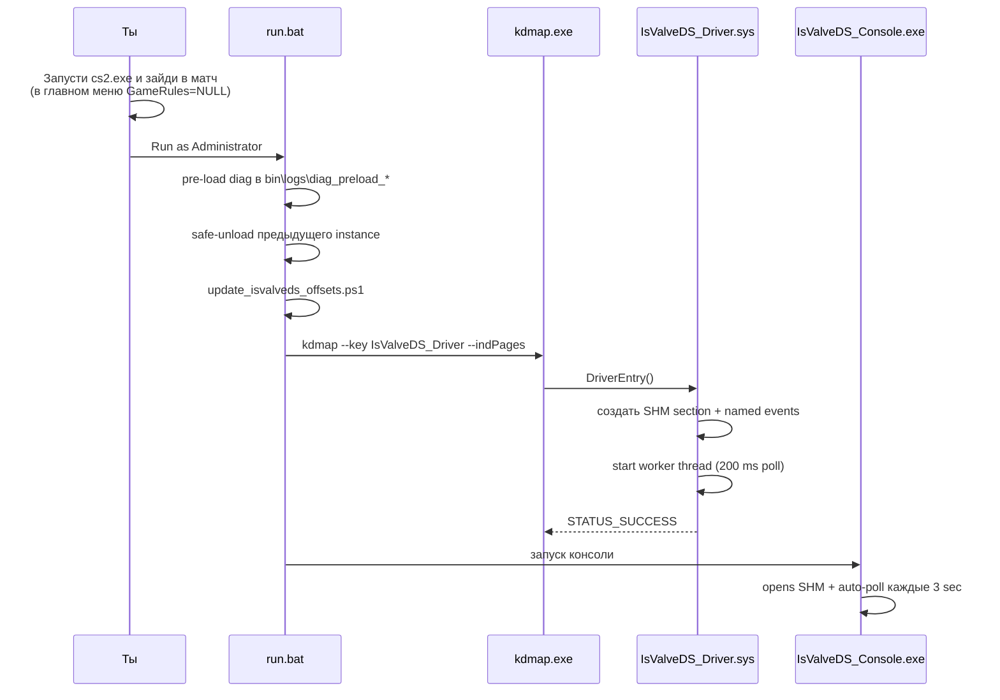

**Команды консоли:**

| Команда | Действие |
|---|---|
| `r` / `s` | показать текущий snapshot |
| `0` / `1` | записать `m_bIsValveDS = 0/1` |
| `w 0` / `w 1` | то же |
| `stop` | попросить driver выгрузиться |
| `h` / `?` | help |
| `q` | закрыть консоль (driver остаётся в kernel) |

> [!TIP]
> **`IsValveDS_Console.log`** пишется рядом с exe — там timestamped лог каждого WinAPI call, каждой команды, и unhandled exception filter. При баге **приложи этот файл** к report — он почти всегда содержит точную причину.

---

## 🛑 Остановка

<table>
<tr><th>Kit</th><th>Команда</th></tr>
<tr><td>F20Kit</td><td><code>STOP.bat</code></td></tr>
<tr><td>IsValveDS</td><td><code>bin\stop.bat</code> или <code>stop</code> в консоли</td></tr>
</table>

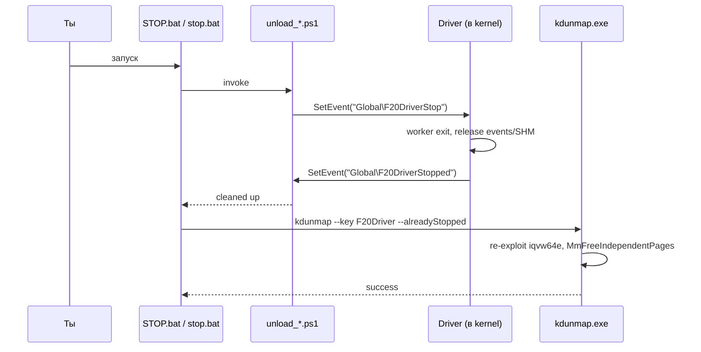

> [!NOTE]
> Если worker не подтвердил cleanup в течение timeout — STOP скрипт **не делает blind free** и предлагает reboot. Это защита от kernel corruption.

---

## 🩺 Диагностика

### Файлы

```text
F20Kit/
├─ START_LAST.log                 ← заголовок последнего запуска
├─ logs/
│  ├─ start_<timestamp>.log       ← per-run launcher log
│  ├─ diag_preload_<timestamp>/   ← pre-load диагностический бандл
│  │  ├─ summary.txt
│  │  ├─ analyze_output.txt
│  │  ├─ kdmap_output.txt         ← kernel map ouput
│  │  ├─ os_systeminfo.txt
│  │  ├─ security_boot_ci.txt
│  │  ├─ processes.txt
│  │  ├─ drivers_services.txt
│  │  ├─ cs2_offsets.json
│  │  └─ ...
│  └─ stop_<timestamp>/           ← после STOP.bat
```

### DebugView (kernel-mode logs)

DebugView от Sysinternals: [download](https://learn.microsoft.com/en-us/sysinternals/downloads/debugview).

**Шаги:**
1. Запусти `dbgview64.exe` **от администратора**
2. `Capture` menu → ✅ `Capture Kernel` + ✅ `Capture Events`
3. `Edit` menu → `Filter/Highlight` → Include: `F20Drv*` (или `IsVDS*` для IsValveDS)

**Ожидаемые строки F20Driver v16:**

```
[F20Drv] ======================================
[F20Drv]    F20Driver v16 (lean worker, 100 ms poll, no mid-session re-resolve)
[F20Drv] ======================================
[F20Drv] OS: 10.0 build 26200 (Win11)
[F20Drv] CS2 offsets from registry: ctrl=0x2320720 track=0x818 kills=0x128
[F20Drv] Inject ENABLED: targets=N cb=0xFFFF...
[F20Drv] WARN: REMINDER 1/2: NumLock MUST be ON ...
[F20Drv] WARN: REMINDER 2/2: Paste this in CS2 console once: unbind p; unbind F13; ...
[F20Drv] Found cs2.exe PID=0x...
[F20Drv] client.dll=0x..., entering inner loop
[F20Drv] Baseline RK=0
[F20Drv] KILL RK=0->1  P hold=2347ms  tap scan=0x67 sign=NEG magIdx=6 (hist=1) tap=55ms (scheduled 287ms before P-up)
[F20Drv] yaw tap fired scan=0x67 (~287ms before P-up)
[F20Drv] P up
```

### IsValveDS_Console.log

Console **сама** пишет structured log рядом с exe:

```
[01:23:45.678] INFO  argc=1
[01:23:45.679] INFO    argv[0]=IsValveDS_Console.exe
[01:23:45.681] INFO  env: cwd=E:\NL\IsValveDS\bin session=1 user=John computer=PC1
[01:23:45.683] INFO  env: Windows 10.0 build 26200 (sp=0, type=1)
[01:23:45.685] INFO  Banner printed
[01:23:45.686] INFO  OpenEventA(Global\IsValveDSStop)
[01:23:45.688] INFO  stop event opened ok: handle=0x...
[01:23:45.690] INFO  OpenFileMappingA(Global\IsValveDSState)
[01:23:45.692] INFO  SHM handle ok: 0x...
[01:23:45.693] INFO  MapViewOfFile size=128
[01:23:45.695] INFO  SHM mapped at 0x...
[01:23:45.697] INFO  CreateFileA(CONIN$)
[01:23:45.699] INFO  CONIN$ opened: 0x...
[01:23:45.701] INFO  entering command loop
[01:24:01.234] INFO  cmd in: "1"
[01:24:01.456] INFO  PollerThread enter
```

**При ошибке** WinAPI:

```
[..] ERROR OpenFileMapping failed: 2 (Не удается найти указанный файл.)
```

И **SEH crash dump**:

```
[..] ERROR UNHANDLED EXCEPTION code=0xC0000005 flags=0x00000000 addr=0x... numparams=2
[..] ERROR   param[0] = 0x0000000000000000
[..] ERROR   param[1] = 0x0000000000000000
```

---

## ❌ Частые ошибки

<table>
<tr><th>Симптом</th><th>Причина</th><th>Фикс</th></tr>
<tr><td><code>STATUS_IMAGE_CERT_REVOKED / 0xC0000603</code></td><td>VulnerableDriverBlocklist блокирует <code>iqvw64e</code></td><td><code>preflight.bat</code> → reboot, или START.bat сам применит fix</td></tr>
<tr><td><code>Device\Nal already in use</code></td><td>Lingering Intel vulnerable driver</td><td>reboot, либо <code>sc stop iqvw64e</code></td></tr>
<tr><td><code>STATUS_ACCESS_DENIED / 0xC0000022</code></td><td>AntiCheat (vgc / EAC / FACEIT) запущен</td><td>START.bat сам убьёт; FACEIT иногда работает даже с закрытой игрой</td></tr>
<tr><td><code>F20Drv: Inject DISABLED</code></td><td>analyzer не нашёл safe RVA</td><td>Monitor-only mode — пришли <code>diag_collect.bat</code> zip разработчику</td></tr>
<tr><td>Numpad работает как стрелки</td><td>NumLock = OFF</td><td>Включи NumLock на клавиатуре</td></tr>
<tr><td><code>IsVDS: GameRules NULL</code></td><td>Главное меню или сервер не создал C_CSGameRules</td><td>Зайди в матч</td></tr>
<tr><td>Console мгновенно exit</td><td>Старый build без CONIN$ reader</td><td>Скачай latest release (≥ v1.0)</td></tr>
<tr><td><code>Cannot open SHM</code></td><td>Driver не загружен ИЛИ namespace race</td><td>Проверь <code>IsValveDS_Console.log</code> + DebugView</td></tr>
<tr><td>Драйвер не реагирует на kills</td><td>Стартовал после захода на сервер</td><td>Перезайди на сервер — driver баselin'ит на следующем read</td></tr>
<tr><td>FPS dip / stutter</td><td>Старый build (v14/v15) с mid-session re-resolve</td><td>Обнови до v1.6+ (v16 без watchdog'ов)</td></tr>
</table>

---

## 🧰 VC++ runtime

Kits **уже содержат** четыре app-local DLL рядом с `kdmap.exe` / `kdunmap.exe`:

| DLL | Размер | Назначение |
|---|---|---|
| `msvcp140.dll` | ~550 KB | C++ standard library |
| `vcruntime140.dll` | ~125 KB | base C runtime |
| `vcruntime140_1.dll` | ~50 KB | C runtime extension |
| `concrt140.dll` | ~325 KB | concurrency runtime |

> [!IMPORTANT]
> **На стоковом Windows 10/11 install kit работает БЕЗ установленного VC Redist.** `IsValveDS_Console.exe` и `analyze_kbdclass.exe` собраны `/MT` (static CRT), вообще без зависимостей на эти DLL.

### Если AV квартинил DLL или хочешь системный install

Запусти `install_vcredist.bat`:

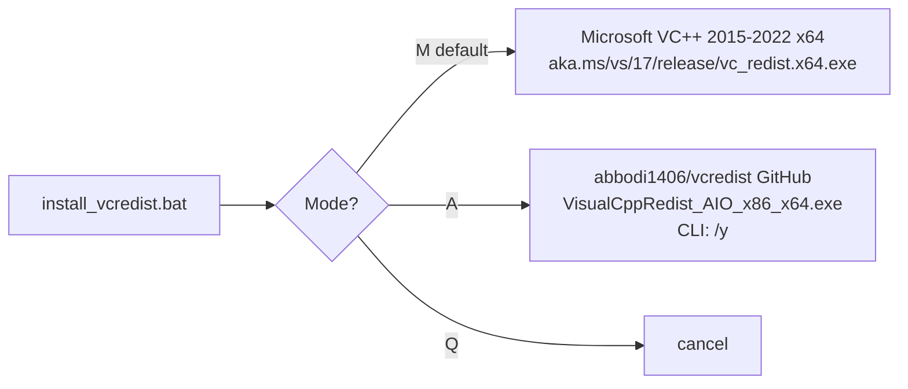

В репозитории **не хранится** сторонний `.exe`.

---

## 🔨 Сборка из исходников

**Требования:**
- Visual Studio 2022 (C++ workload)
- Windows SDK / WDK 10.0.26100.x (NuGet packages)
- PowerShell 5+
- `TheCruZ/kdmapper` склонирован рядом с репо как `..\kdmapper`

**Одна команда из корня:**

```powershell
powershell -NoProfile -ExecutionPolicy Bypass -File scripts\build_release.ps1
```

Скрипт собирает все 6 проектов, копирует app-local VC++ runtime DLLs, синхронизирует binaries в `kits/`, пересобирает оба zip-а и печатает SHA-256.

---

## 🤖 GitHub Actions

Workflow `.github/workflows/build-release.yml` делает то же самое на Windows Server 2022:

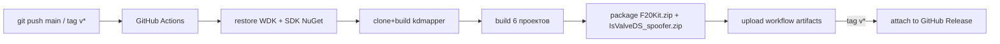

Публикация релиза из git:

```powershell
git tag v1.7
git push origin v1.7
```

---

## 📁 Структура репозитория

```text
NL_Drive_CS2/
├─ src/                              ← исходники
│  ├─ drivers/
│  │  ├─ F20Driver/                  ← kernel — kill trigger + yaw inject
│  │  └─ IsValveDS/                  ← kernel — m_bIsValveDS spoofer
│  ├─ apps/
│  │  └─ IsValveDSConsole/           ← user-mode SHM console (file-logger + SEH)
│  └─ tools/
│     ├─ analyze_kbdclass/           ← PDB-based kbdclass analyzer
│     ├─ kdmap/                      ← tracked mapper wrapper
│     └─ kdunmap/                    ← tracked unmapper wrapper
├─ kits/                             ← готовые kit'ы (zip source)
│  ├─ F20Kit/
│  └─ IsValveDS/
├─ scripts/
│  └─ build_release.ps1              ← локальная сборка + sync + zip
├─ .github/workflows/
│  └─ build-release.yml              ← CI build + auto-release
└─ docs/
   ├─ WIKI.md                        ← этот документ
   └─ assets/                        ← README/wiki images
```

---

## ⚖️ Disclaimer

Research / educational проект. Код документирует Windows kernel-mode техники:

- kdmapper-style manual map без IRP
- `MmCopyVirtualMemory`-based cross-process IO
- SHM + named event control plane
- SEH-wrapped PEB walks
- PDB-symbol resolution через Microsoft Symbol Server
- BCryptGenRandom kernel RNG

используя Counter-Strike 2 как **измеримую цель**. Использование инжекта или game-modifying драйверов против live multiplayer серверов **запрещено** Valve. Ты несёшь ответственность за то, как используешь этот код.

---

<br>
<br>
<br>

---

<div align="center">

# 🇬🇧 EN Full guide

</div>

## 📑 Table of contents

- [🌟 Overview](#-overview)
- [⚙️ F20Driver internals](#%EF%B8%8F-f20driver-internals)
- [🪪 IsValveDS internals](#-isvalveds-internals)
- [💻 System requirements](#-system-requirements-en)
- [📦 Install](#-install)
- [🚀 F20Kit launch](#-f20kit-launch)
- [⌨️ Yaw bind table](#%EF%B8%8F-yaw-bind-table)
- [📋 One-line CS2 console paste](#-one-line-cs2-console-paste)
- [🪪 IsValveDS launch](#-isvalveds-launch)
- [🛑 Stop / unload](#-stop--unload)
- [🩺 Diagnostics](#-diagnostics)
- [❌ Common errors](#-common-errors)
- [🧰 VC++ runtime](#-vc-runtime-en)
- [🔨 Build from source](#-build-from-source)
- [🤖 GitHub Actions](#-github-actions-en)

---

## 🌟 Overview

<table>
<tr>
<th width="50%">🎯 F20Kit</th>
<th width="50%">🪪 IsValveDS spoofer</th>
</tr>
<tr><td valign="top">

Kernel-mode round-kill detector + yaw injector.

**Per kill:**
- 🔻 presses `P` ↓
- ⏱ holds for **randomized 1500-3000 ms**
- 🎲 **245-350 ms before release** taps one of 22 keys (Numpad 0-9 + F13-F24) bound to yaw `[-35°..+35°]` in the cheat
- 🔺 releases `P` ↑

**OPSEC:**
- yaw sign alternates (POS ↔ NEG) every kill
- magnitude uniform-random from **10 candidates** (excluding last **3-8** from history)
- no `+M / -M` pairs, no repeat magnitude within 3-8 kill window
- timing fully randomized — no periodic pattern

</td><td valign="top">

Kernel-mode `CCSGameRules::m_bIsValveDS` spoof.

**Architecture:**
- SHM + named event control plane (NO IRP)
- user-mode SHM console drives the driver
- driver re-resolves `cs2.exe → client.dll → dwGameRules → field` every iteration
- survives cs2 restart and map flip

**Diagnostics:**
- console writes full `IsValveDS_Console.log` with timestamps, `FormatMessageA` for every WinAPI failure, SEH/CRT exception filter

</td></tr>
</table>

---

## ⚙️ F20Driver internals

### CS2 memory read chain

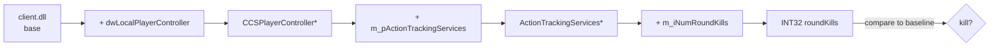

Per poll tick (every **100 ms**) the driver:
1. Performs one `MmCopyVirtualMemory` chain (3 cross-process reads)
2. Compares against baseline
3. If `roundKills > lastRoundKills` and not in cooldown → **TRIGGER**

### One-kill timeline

```mermaid
gantt
  title Single kill cycle (randomized timing)
  dateFormat X
  axisFormat %L
  section P (hold key)
  P down :crit, p1, 0, 2500
  P up :milestone, p2, 2500, 0
  section yaw tap
  wait :wait, 0, 2200
  tap down :active, t1, 2200, 55
  tap up :milestone, t2, 2255, 0
```

| Parameter | Min | Max | Purpose |
|---|---|---|---|
| `KILL_HOLD_MS` | **1500 ms** | **3000 ms** | how long `P` is held |
| `TAP_LEAD_MS` | **245 ms** | **350 ms** | how long before `P-up` the tap fires |
| `NUMPAD_TAP_MS` | **55 ms** | **55 ms** | how long the tap key is held |
| `POLL_INTERVAL_MS` | **100 ms** | — | how often driver reads the chain |

### Picker — choosing the tap key

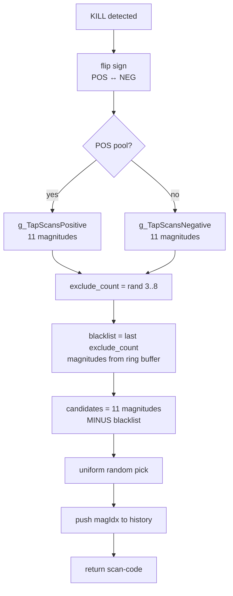

- Yaw sign **always** flips per kill
- Magnitude **does not repeat** within a 3-to-8-kill window (random window)
- Pool never empty: 11 magnitudes − up to 8 blacklist = **at least 3 candidates**

### Inject self-recovery

If `g_KbdCallback` raises an SEH exception (kbdclass busy / one bad target):

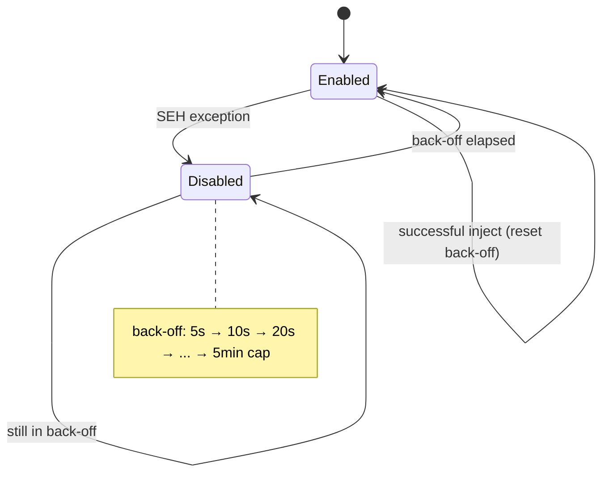

Previously a single SEH exception permanently disabled inject. Now exponential back-off with auto-recovery.

---

## 🪪 IsValveDS internals

### Architecture

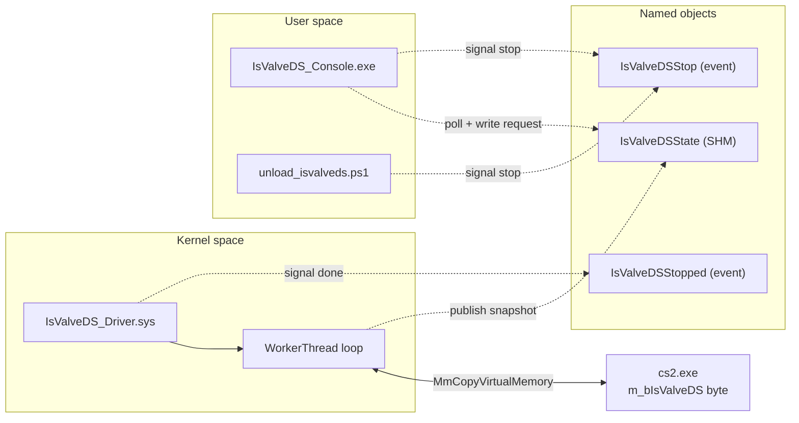

---

## 💻 System requirements (EN)

| Component | Requirement | Auto-fixed? |
|---|---|---|
| OS | Windows 10 (1607+) / 11 x64 | — |
| Privileges | Administrator | ✅ launcher self-elevates |
| Secure Boot | OFF | ❌ BIOS/UEFI only |
| HVCI / Memory Integrity | OFF | ✅ START.bat |
| VulnerableDriverBlocklist | `= 0` | ✅ START.bat (reboot) |
| VC++ Redist | not required | ✅ app-local DLLs |
| Python | not required | — |
| cs2.exe | running | — |
| NumLock | ON for Numpad part | ❌ manual |
| AntiCheat | not running | ✅ START.bat |
| `iqvw64e` lingering | not loaded | ✅ START.bat |

> [!IMPORTANT]
> **Start the driver BEFORE joining a server.** The v16 worker does NO mid-session re-resolve. If you start it after joining and kills don't fire, rejoin the server once.

---

## 📦 Install

1. Open [📦 Releases](https://github.com/ccsimplyspolit/NL_Drive_CS2/releases/latest)
2. Download:

| Archive | Contents |
| --- | --- |
| **`F20Kit.zip`** | F20Driver.sys + START/STOP bats + analyzer + kdmap/kdunmap + PS1 scripts + app-local VC++ runtime + install_vcredist.bat |
| **`IsValveDS_spoofer.zip`** | IsValveDS_Driver.sys + IsValveDS_Console.exe + run/stop bats + kdmap/kdunmap + PS1 scripts + app-local VC++ runtime + install_vcredist.bat |

3. Extract to a short path without special characters, e.g. `C:\NL_Drive_CS2\F20Kit`

---

## 🚀 F20Kit launch

```text
1. Launch CS2 (Fullscreen Windowed).
2. Turn NumLock ON (LED lit).
3. Right-click F20Kit\START.bat → Run as Administrator.
4. Wait for "Driver loaded".
5. Open CS2 console (~) and paste the one-line unbind shown by START.bat.
6. Configure your cheat's yaw "Local view" / MOUSE OVERRIDE bind list
   to match the table below.
7. Join a server. Play.
```

---

## ⌨️ Yaw bind table

| 🟢 POSITIVE | scan | yaw | | 🔴 NEGATIVE | scan | yaw |
|---|---|---|---|---|---|---|
| Num1 | `0x4F` | **+1°** | | Num0 | `0x52` | **−1°** |
| Num2 | `0x50` | **+4°** | | Num3 | `0x51` | **−4°** |
| Num4 | `0x4B` | **+8°** | | Num5 | `0x4C` | **−8°** |
| Num6 | `0x4D` | **+11°** | | Num7 | `0x47` | **−11°** |
| Num8 | `0x48` | **+15°** | | Num9 | `0x49` | **−15°** |
| F13 | `0x64` | **+18°** | | F14 | `0x65` | **−18°** |
| F15 | `0x66` | **+21°** | | F16 | `0x67` | **−21°** |
| F17 | `0x68` | **+25°** | | F18 | `0x69` | **−25°** |
| F19 | `0x6A` | **+28°** | | F20 | `0x6B` | **−28°** |
| F21 | `0x6C` | **+32°** | | F22 | `0x6D` | **−32°** |
| F23 | `0x6E` | **+35°** | | F24 | `0x76` | **−35°** |

Hold key: `P` (scan `0x19`), randomized **1500–3000 ms** per kill.

---

## 📋 One-line CS2 console paste

```text
unbind p; unbind F13; unbind F14; unbind F15; unbind F16; unbind F17; unbind F18; unbind F19; unbind F20; unbind F21; unbind F22; unbind F23; unbind F24; unbind KP_INS; unbind KP_END; unbind KP_DOWNARROW; unbind KP_PGDN; unbind KP_LEFTARROW; unbind KP_5; unbind KP_RIGHTARROW; unbind KP_HOME; unbind KP_UPARROW; unbind KP_PGUP
```

> [!CAUTION]
> **NumLock MUST be ON.** Otherwise scan codes `0x47..0x52` register as nav-cluster (`Home/End/arrows/Ins/PgUp/PgDn`).

---

## 🪪 IsValveDS launch

```text
1. Launch CS2 and join a match (in main menu GameRules is NULL).
2. Right-click IsValveDS\bin\run.bat → Run as Administrator.
3. Wait for "IsValveDS Spoofer - console" window.
4. Use commands: r / 0 / 1 / w 0 / w 1 / stop / h / q
```

Console writes `IsValveDS_Console.log` next to the exe — attach this file to any bug report.

---

## 🛑 Stop / unload

| Kit | Command |
|---|---|
| F20Kit | `STOP.bat` |
| IsValveDS | `bin\stop.bat` or `stop` in console |

Soft stop event → wait for done event → tracked `kdunmap --alreadyStopped`. If worker-exit not confirmed → refuses blind unmap, asks for reboot.

---

## 🩺 Diagnostics

DebugView from Sysinternals, filter `F20Drv*` (or `IsVDS*`). Expected lines after a kill:

```
[F20Drv] KILL RK=2->3  P hold=2347ms  tap scan=0x67 sign=NEG magIdx=6 (hist=12) tap=55ms (scheduled 287ms before P-up)
[F20Drv] yaw tap fired scan=0x67 (~287ms before P-up)
[F20Drv] P up
```

---

## ❌ Common errors

| Symptom | Cause | Fix |
|---|---|---|
| `STATUS_IMAGE_CERT_REVOKED` | VulnerableDriverBlocklist blocks `iqvw64e` | preflight.bat → reboot |
| `Device\Nal already in use` | Lingering Intel driver | reboot |
| `STATUS_ACCESS_DENIED` | AntiCheat running | START.bat kills them |
| `Inject DISABLED` | No safe RVA found | Monitor-only mode |
| Numpad acts like arrows | NumLock OFF | Enable NumLock |
| `GameRules NULL` | Main menu / no server | Join a match |
| Console exits | Old build w/o CONIN$ | Use latest release |
| Driver doesn't react to kills | Started after join | Rejoin the server |
| FPS dip | Old build (v14/v15) | Upgrade to v1.6+ |

---

## 🧰 VC++ runtime (EN)

Kits ship four app-local DLLs next to `kdmap.exe`/`kdunmap.exe`:
- `msvcp140.dll`, `vcruntime140.dll`, `vcruntime140_1.dll`, `concrt140.dll`.

Kits work on a clean Windows install **without VC++ Redistributable**. Console + analyzer are linked `/MT`.

If DLLs got quarantined, run `install_vcredist.bat` (Microsoft or AIO source, M/A/Q selector).

---

## 🔨 Build from source

Requirements: VS 2022, Windows SDK/WDK 10.0.26100.x, PS 5+, `TheCruZ/kdmapper` at `..\kdmapper`.

```powershell
powershell -NoProfile -ExecutionPolicy Bypass -File scripts\build_release.ps1
```

Builds all 6 projects, copies app-local runtime, syncs into kits/, rebuilds both release zips, prints SHA-256.

---

## 🤖 GitHub Actions (EN)

`.github/workflows/build-release.yml`:
- restores WDK/SDK NuGet packages
- builds `kdmapper` static library
- builds drivers / tools / console
- packages both zips
- uploads artifacts on every build
- attaches zips to GitHub Release on `v*` tag push

```powershell
git tag v1.7
git push origin v1.7
```

---

<div align="center">

📦 [**Latest release**](https://github.com/ccsimplyspolit/NL_Drive_CS2/releases/latest) · 📂 [Repository](https://github.com/ccsimplyspolit/NL_Drive_CS2) · 🐛 [Issues](https://github.com/ccsimplyspolit/NL_Drive_CS2/issues)

</div>
